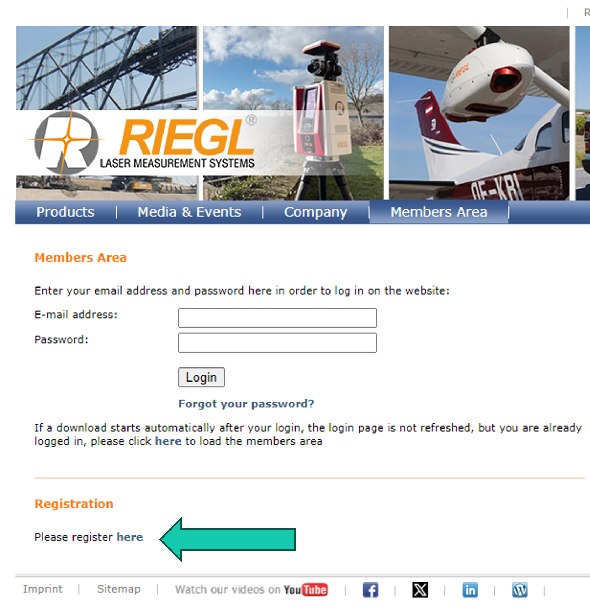
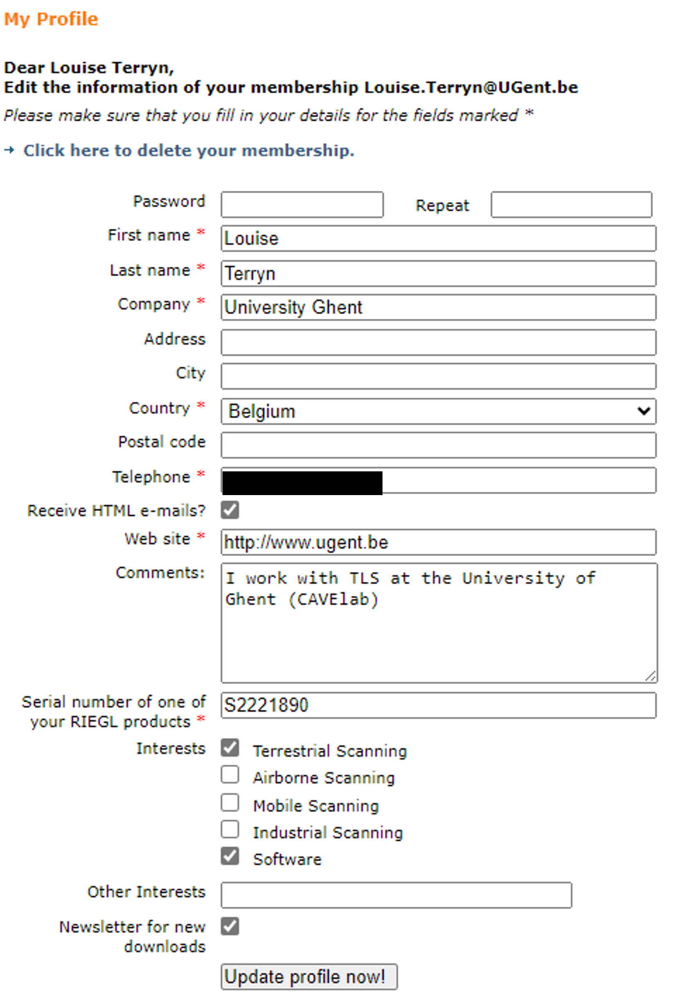
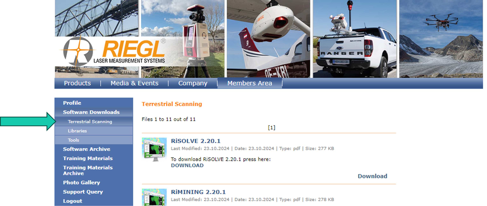
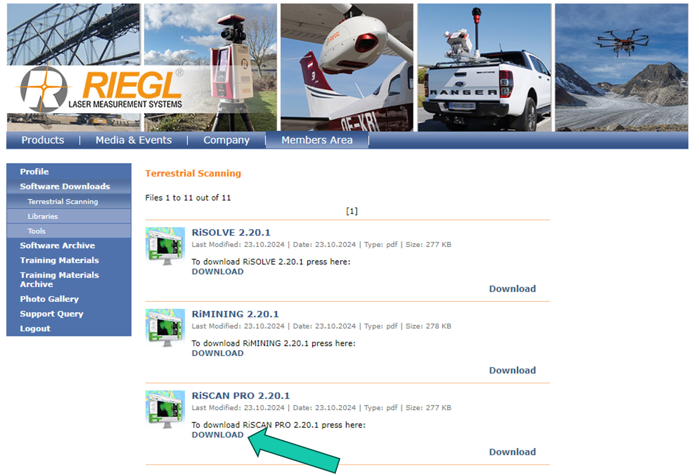
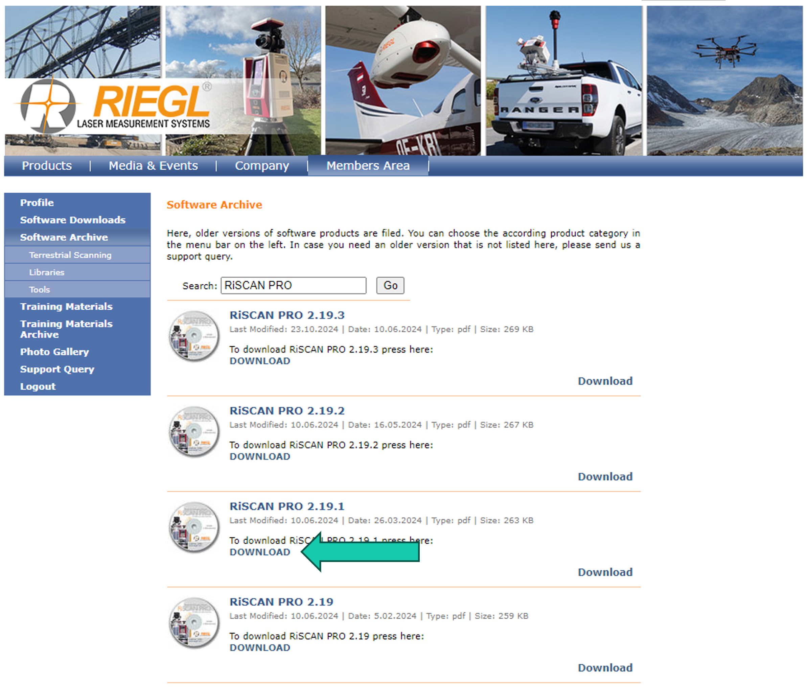
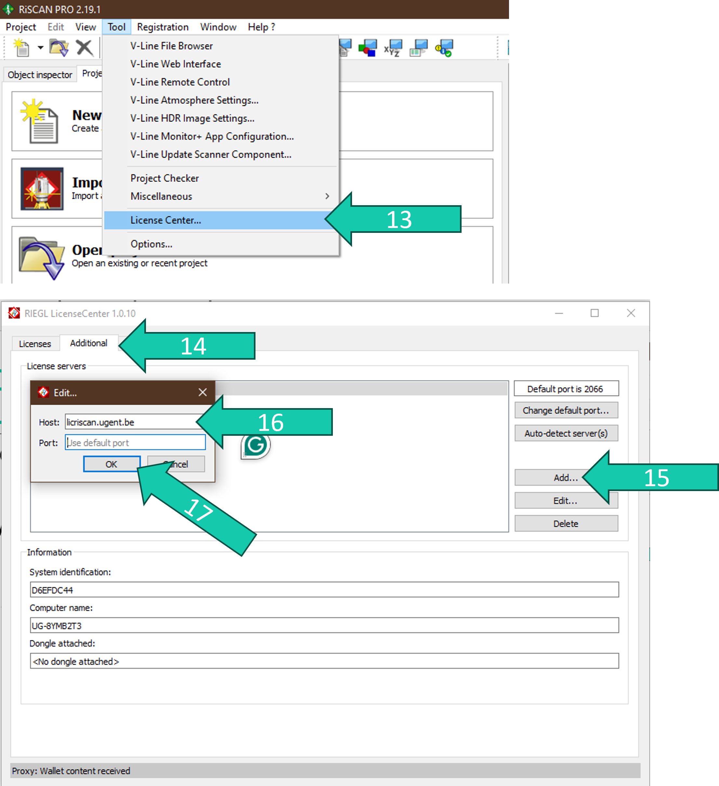
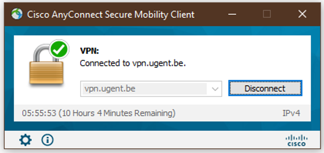

# Installation of RiSCAN PRO
To download the RiSCAN PRO software you need to register for an account on the RIEGL website.

1. Go to http://www.riegl.com/members-area/. 
2. Click *register here* and fill in your information (example of what I filled in below).

Once your account is confirmed you can log in:

3. Go to http://www.riegl.com/members-area/. 
4. *Login*.
5. Go to *Software Downloads > Terrestrial Scanning*.

Here you can download the latest version of RiSCAN PRO. Make sure we have a license for the latest version (ask Kim/Louise). If not see steps 8-11.

6. Click *DOWNLOAD*.
7. Follow the steps in the installer. 

If we do not have the license to use the latest version of RiSCAN PRO follow these steps: 

8. Go to *Software Archive > Terrestrial Scanning*. 
9. Type RiSCAN PRO in the search bar and click go
10. Download the last version we have a license to use. (2024: 2.19.1) by clicking on *DOWNLOAD*.
11. Follow the steps in the installer.

Now we still need to set the license:

12. Open RiSCAN PRO.
13. Go to *Tool > License Center…*.
14. Go to *Additional*.
15. Click *Add…*.
16. Fill in licriscan.ugent.be under *Host*
17. Click *OK*.
18. Close the License Center & RiSCAN PRO.

To use RiSCAN PRO under these licenses you have to open RiSCAN PRO while being connected with the UGent VPN.

Go to https://helpdesk.ugent.be/vpn/en/asa.php if you don’t know how this UGent VPN works.

