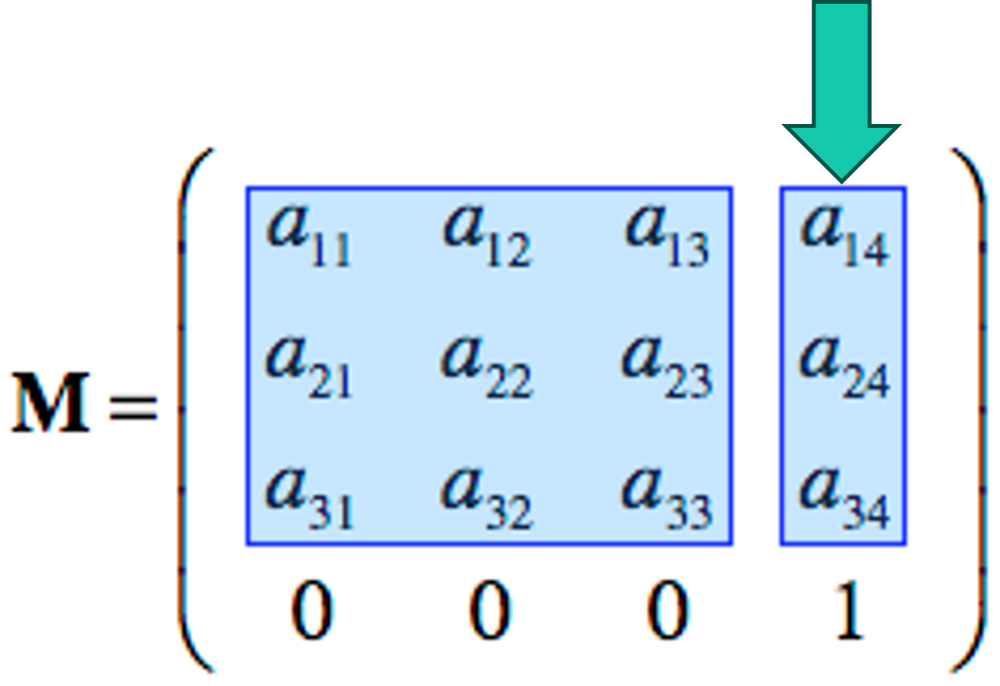
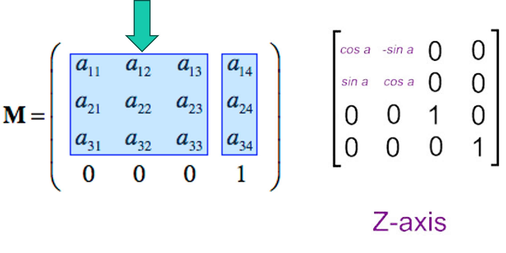
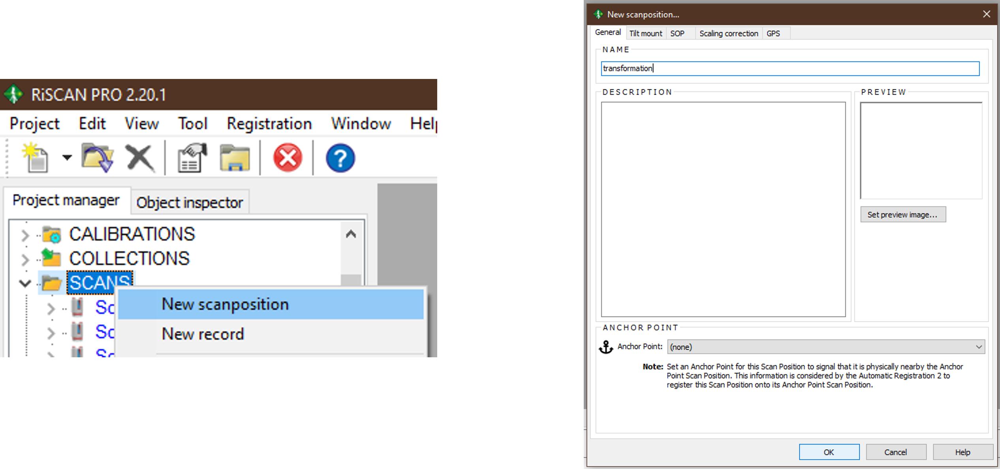
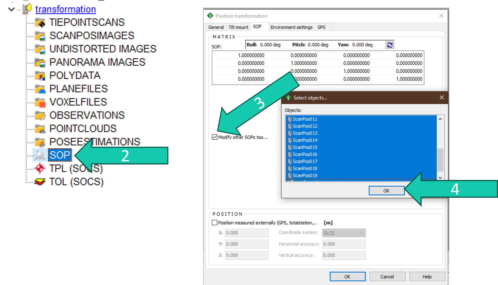
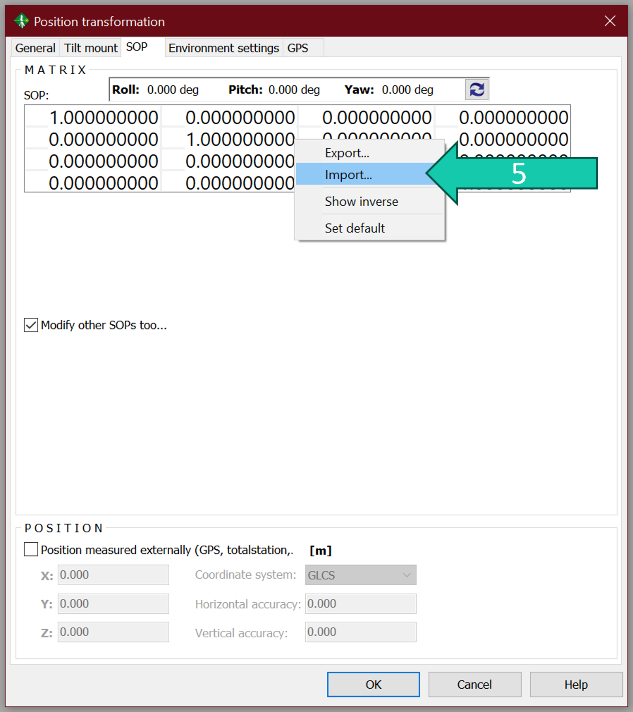
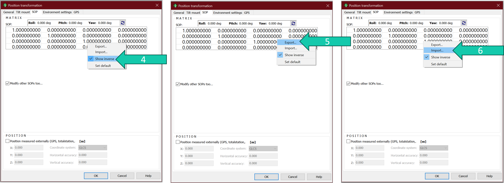
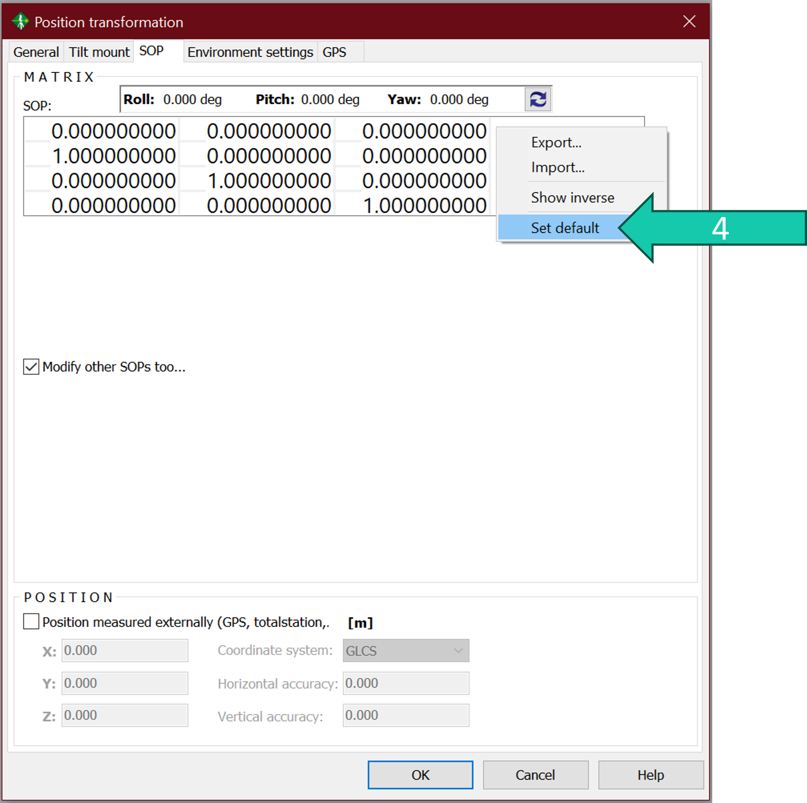

# Transform point clouds 
You might want to perform a transformation on you scans (e.g. to match the coordinate system with one that you measured in the field for other sensors for example; to make nicer figures; etc.).

First you have to determine your transformation matrix (see below). This is a 4x4 matrix which determines the rotation and translation you want to perform. 

The last column (except for the last row) determines the translation with first, second and third row the x, y and z translation respectively. So, for example, if you want your point cloud to shift -2 on x-as you replace a14 with -2.

The first three columns (except for the last row) determine the rotation matrix (roll, pitch, yaw). For example, rotating around the z-axis will change the numbers in the first 2 rows & columns (a11, a12, a21, a22). If you want to rotate 30 degrees around the z-axis you need to replace a11 and a22 with cos(30°), a12 with –sin(30°), and a21 with sin(30°).

Save the transformation matrix as a ".dat" file. You can do this by for example opening notepad, copying your transformation matrix in there and saving it as a ".dat".

## Steps
Once you have your transformation matrix. You can apply it in RiSCAN PRO:

1. Make a new scan position (right click *SCANS*, click *New scanposition*) which you call for example "transformation".

> It is recommended to first make a back-up of the SOPs (using the *SOP backup...* option) before going further so you can always go back to your previous situation in case you made a mistake. You can find how to do that here: https://github.com/qforestlab/riscan_registration_VZ400/blob/main/8_save_combine.md.

2. Open the *SOP* (by double-clicking it) of this scan position.
3. Check the *Modify other SOPs too…* and select the scan positions which you want to tranform. Make sure these scan positions are not frozen or it won't work. 
4. Click *OK*. 

5. Right click on the SOP matrix and click *Import...*. 
6. Select the transformation ".dat" file and click *OK*.

## Extra: inverse transformation

If you want to undo a transformation (and haven't made a backup), you need to apply the inverse of the transformation matrix.

1. Open the *SOP* of the transformation scan position by double clicking it. 
2. Check the *Modify other SOPs too…* and select the scan positions which you want to tranform. Make sure these scan positions are not frozen or it won't work. 
3. Click *OK*. 
4. Right click the SOP matrix and click *Show inverse*. (Now RiSCAN PRO will show you the inverse of your original matrix but when clicking OK it will not save it as the new SOP matrix.)
5. Right click the SOP matrix again and select *Export*. 
6. Save this inverse matrix as a ".dat" file.
7. Now right click the matrix again, this time clicking *Import*. Now select the inverse you just saved.
8. Click *OK*. The transformation will be undone.

Alternatively you could also undo the transformation this way:

1. Open the *SOP* of the transformation scan position by double clicking it. 
2. Check the *Modify other SOPs too…* and select the scan positions which you want to tranform. Make sure these scan positions are not frozen or it won't work. 
3. Click *OK*.
4. Right click the SOP matrix and select *Set default* to undo any changes
5. Click *OK*.

