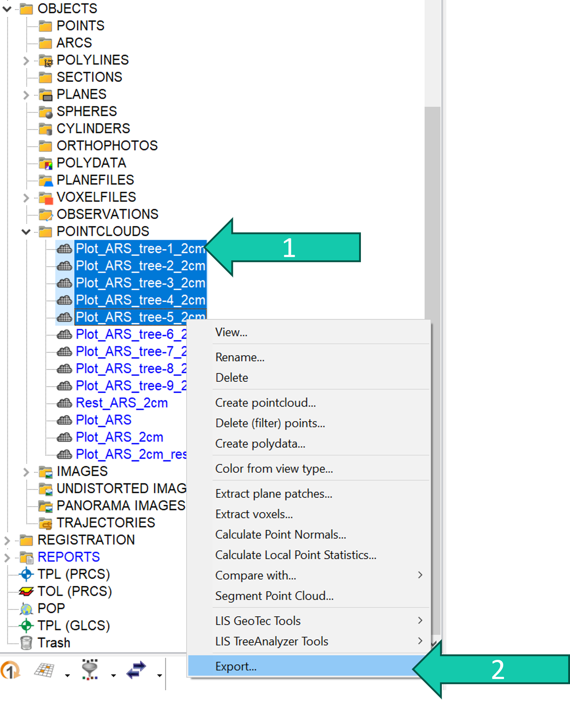
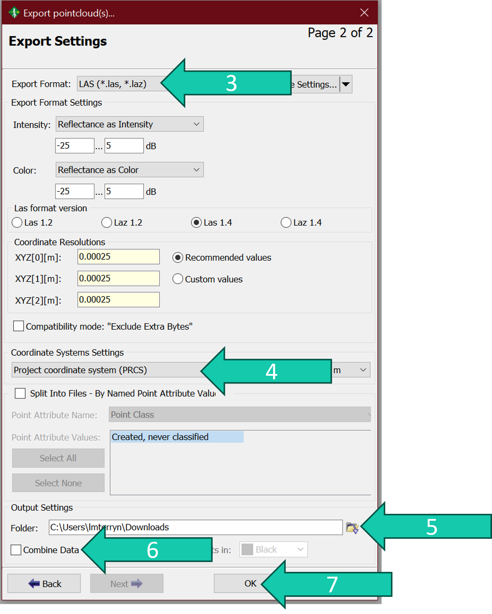

# Export point clouds
It is very easy to export point clouds in RiSCAN PRO.

## Steps
1. Right click on the point cloud(s) you want to export.
2. Click *Export...*.

A screen pops-up where you can choose different settings:

3. Choose a file format. There are different options and might depend on what you want to do with the point clouds further down the line. If you intend to import the point clouds back into RiSCAN PRO do NOT use ".ply". Instead use ".LAS" which is a common point cloud format compatible with different softwares but gives smaller file sizes than the ASCII (".txt"). 
4. Choose a coordinate system you want to export your point clouds in. If you don't need the points in a global coordinate system we recommend using the "Project coordinate system". If you use global coordinate system make sure those settings are well set (see https://github.com/qforestlab/riscan_registration/blob/main/1.GeoSysManager.md)
5. Choose you export path.
6. Check the *Combine Data* box if you want the point clouds to be combined into one point cloud. Uncheck otherwise.
7. Click *OK* to start the export.

