# Select your plot point cloud

There are multiple ways to do this:
* Select your forest plot point cloud with buffer zone using planes
* Select your forest plot point cloud using a polygon

You can find these methods described below.

## Select your forest plot point cloud with buffer zone using planes
### Steps

First we visualise the full point cloud of the forest plot by visualising all scan point clouds or their combined point cloud. 

1. Select the point cloud(s) making up your plot and drag into the viewer (grey area) to visualise the point cloud(s). 
If you're not using a combined point cloud but the separate scan position point clouds the scan positions will be visible in the viewer when visualising the clouds.
However, if your using a combined point cloud this is not the case, so also visualise the scan positions by selecting the SOPs of each scan position and dragging them in the grey area.
2. Select your preferred view type and click *OK*.
3. Put the view in *Perspective view*. 
4. Put the view in *Top view*.

Next we will make two planes along two of the forest plot boarders with the second plane perpendicular to the first plane. 

5. Right-click in the viewer. Go to *New object*.
6. Go to *Plane selection*.
7. Click on *From 2 points...*.

Making the first plane:

8. Click on the 2 outer scan positions of one forest plot boarder to make the first plane.

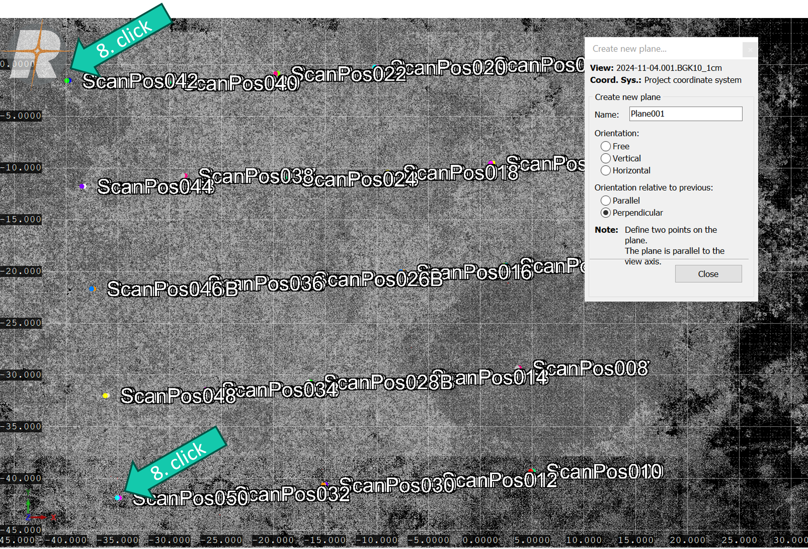

Making the second plane:

9. Indicate perpendicular under *Orientation relative to previous*.
10. Click on the 2 outer scan positions of a perpendicular boarder to the first forest plot boarder to make the second plane.

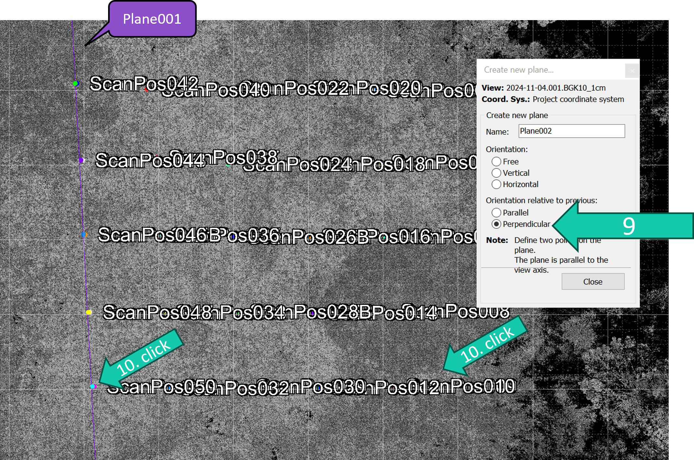

11. Click *Close*.

You can find the two planes in the *Object inspector* under *PLANES*.

Now we want to select the area of the forest plot with a buffer zone:

12. Right-click Plane001 in the *Object inspector* under *PLANES*.
13. Click *Plane select*.

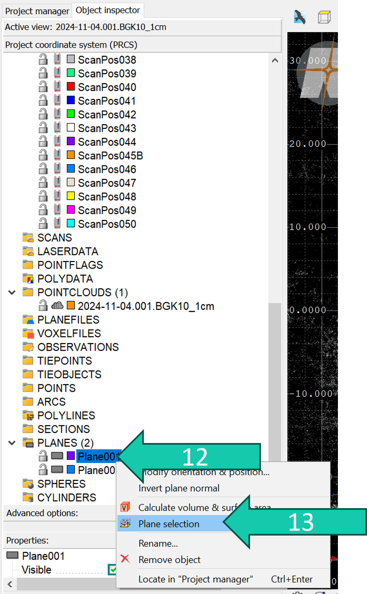

14. Choose the *Above* and *Below* values as buffer and plot size + buffer respectively.
In this example the plot is 40 m x 40 m. You might have to switch the values when you see you don't get the right selection.
16. Click on *Set visibility state*.
17. Click *Apply*.

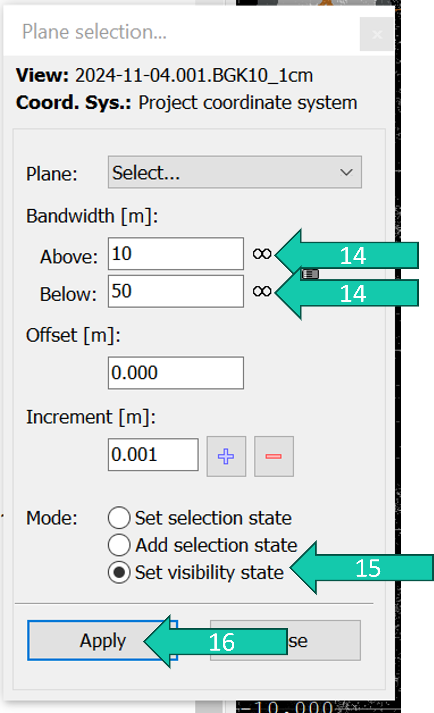

This should only put the region 10 m above your first plane and 50 m below your first plane visible.

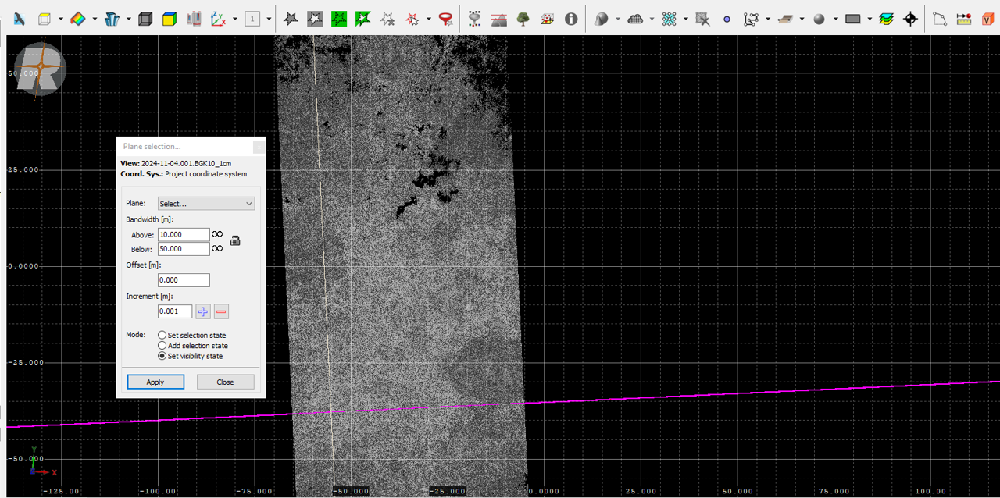

If the wrong area is visible you can always undo this by clicking *Show all*. 

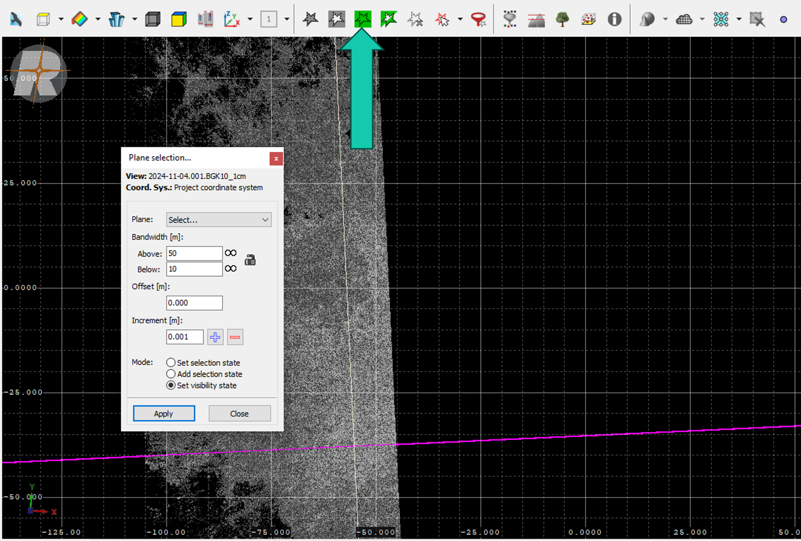

17. Right-click Plane002 in the *Object inspector* under *PLANES*.
18. Click *Plane select*.

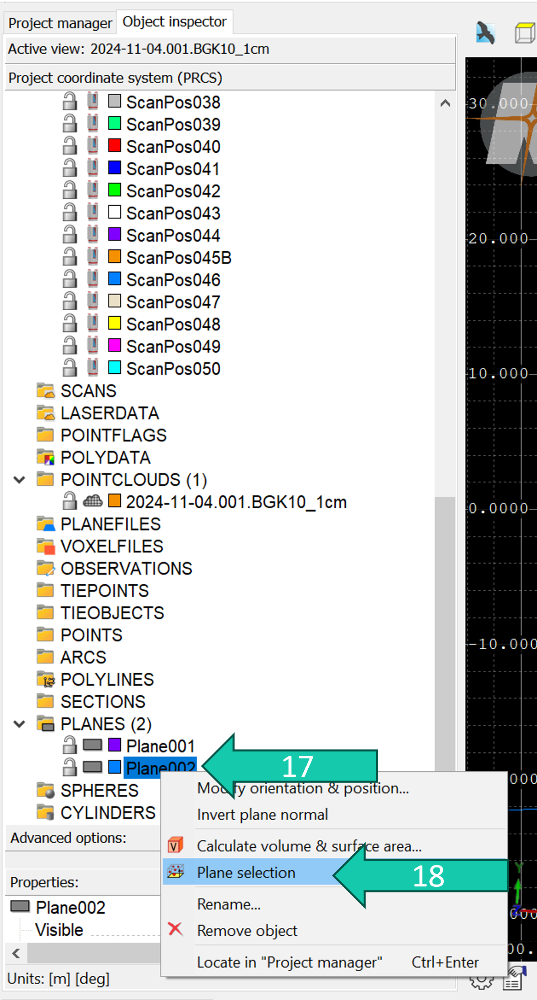

19. Choose the *Above* and *Below* values as buffer and plot size + buffer respectively.
In this example the plot is 40 m x 40 m. You might have to switch the values when you see you don't get the right selection.
20. Click on *Set selection state*.
21. Click *Apply*.

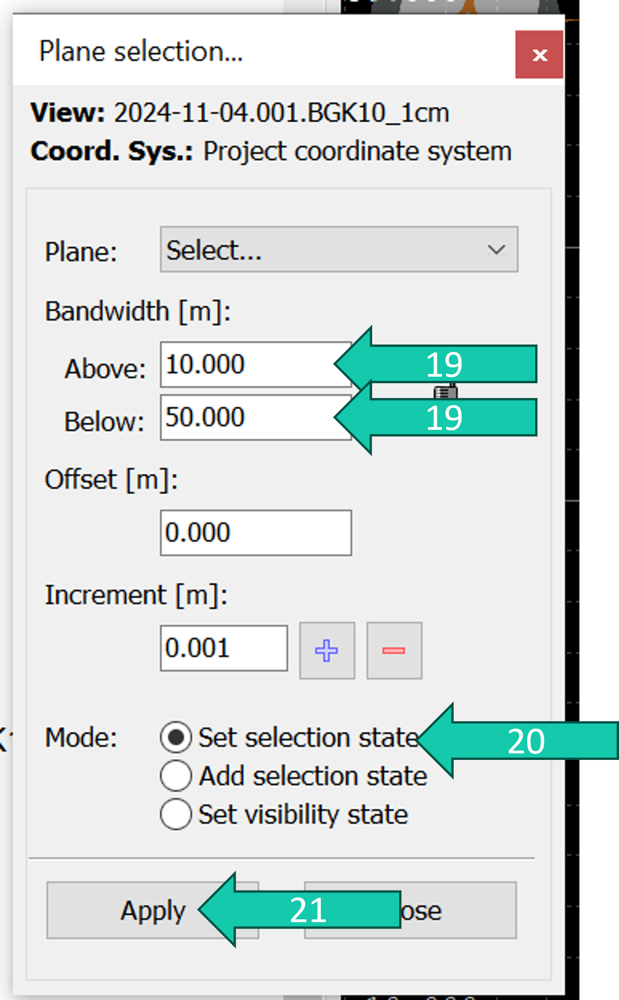

Now your plot with buffer is selected:

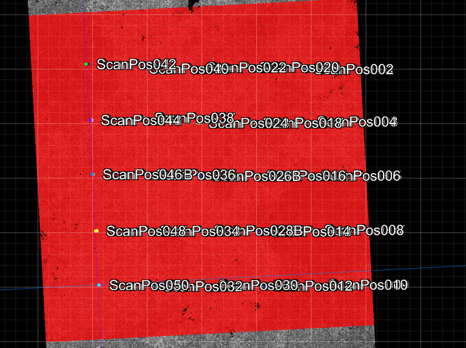

You can copy this to a new point cloud:

22. Go to *Copy selection into new point cloud*.
23. Click *Copy selection with filter setting...*.

24. Choose a good name for this point cloud and change settings as needed.
25. Click *OK*.

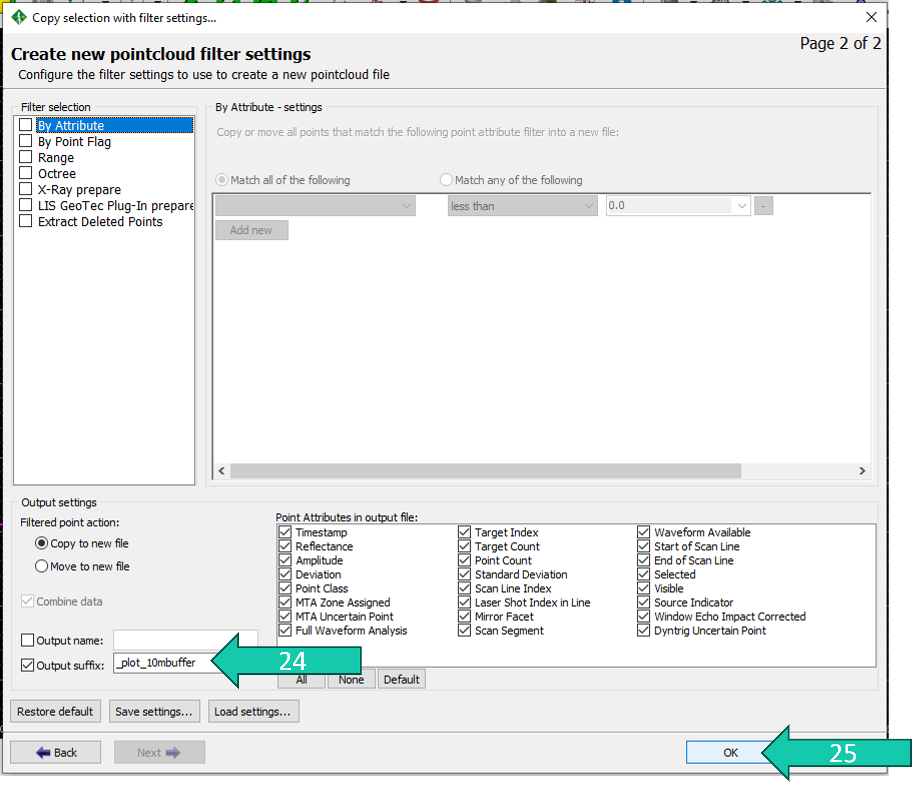

This point cloud will end up under *POINTCLOUDS* in the *Project manager*.

## Select your forest plot point cloud using a polygon
### Steps

First we visualise the full point cloud of the forest plot by visualising all scan point clouds or their combined point cloud. 

1. Select the point cloud(s) making up your plot and drag into the viewer (grey area) to visualise the point cloud(s). 
If you're not using a combined point cloud but the separate scan position point clouds the scan positions will be visible in the viewer when visualising the clouds.
However, if your using a combined point cloud this is not the case, so also visualise the scan positions by selecting the SOPs of each scan position and dragging them in the grey area.
2. Select your preferred view type and click *OK*.
3. Put the view in *Perspective view*. 
4. Put the view in *Top view*.

5. Only visualise the corner scan positions in the *Object inspector* by hiding first hiding all scan positions under *POSITIONS* and then showing the corner scan positions. You can hide all objects by selecting them and right-clicking and clicking *Hide all*. And then you can show the corner scan position by selecting them and righ-clicking and clicking *Show all* or by clicking on the little scanner symbol next to the scan positions individually.
6. You can also hide the point cloud(s) to make it easier to see the scan positions similar to the objects in step 5. Here you can hide/show the point cloud by clicking on the little cloud symbol.

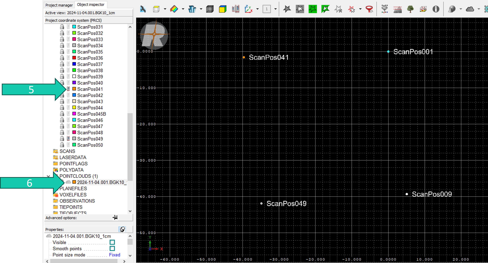

Next we will make a polyline in the shape of our plot using the 4 corner scan positions:

7. Right-click in the viewing area.
8. Go to *New object*.
9. Click on *New polyline*.

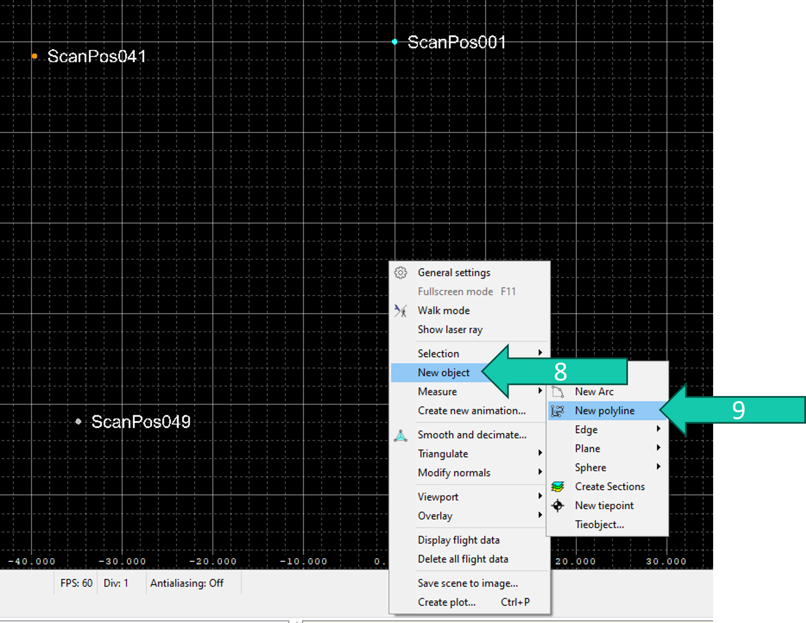

10. Shift+click on each of the corner positions of the plot ending with clicking on the one you started with (a-e). 
11. Click on *Create polyline*.
12. Click on *Close*.

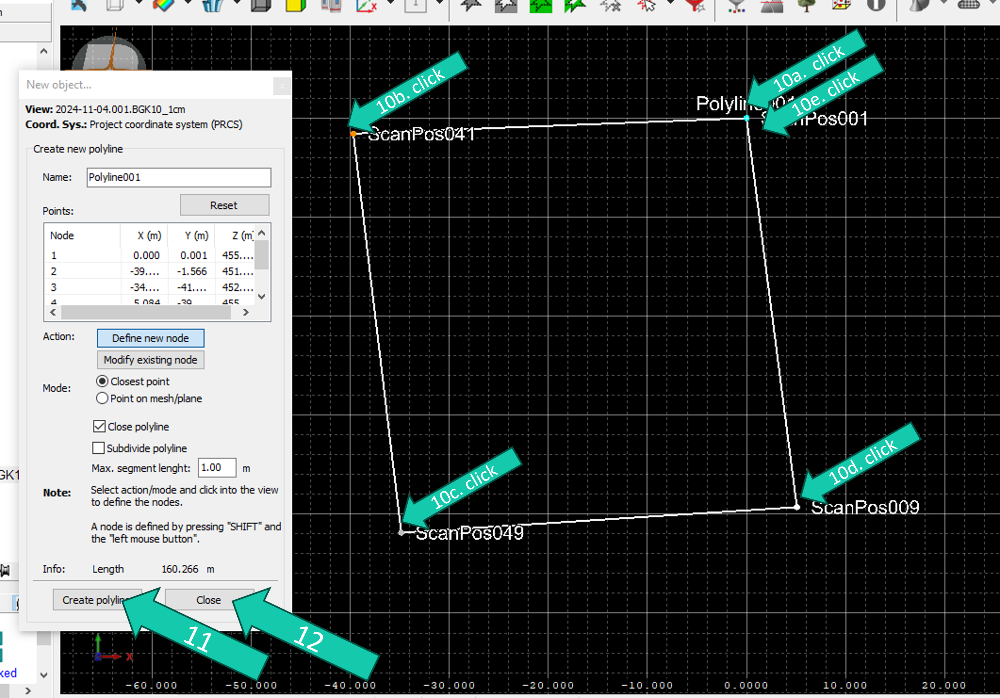

This polyline will show up in your *Object inspector* under *POLYLINES*.

Now we will select the data within this polyline. 

13. Unhide/Show your point cloud again.
14. Right-click on the polyline you created within the *Object inspector*.
15. Click on *Select data*.

Now it will select all the data within the polyline. Once that is done you can copy this data:

16. Go to *Copy selection into new point cloud*.
17. Click *Copy selection with filter setting...*.

18. Choose a good name for this point cloud and change settings as needed.
19. Click *OK*.

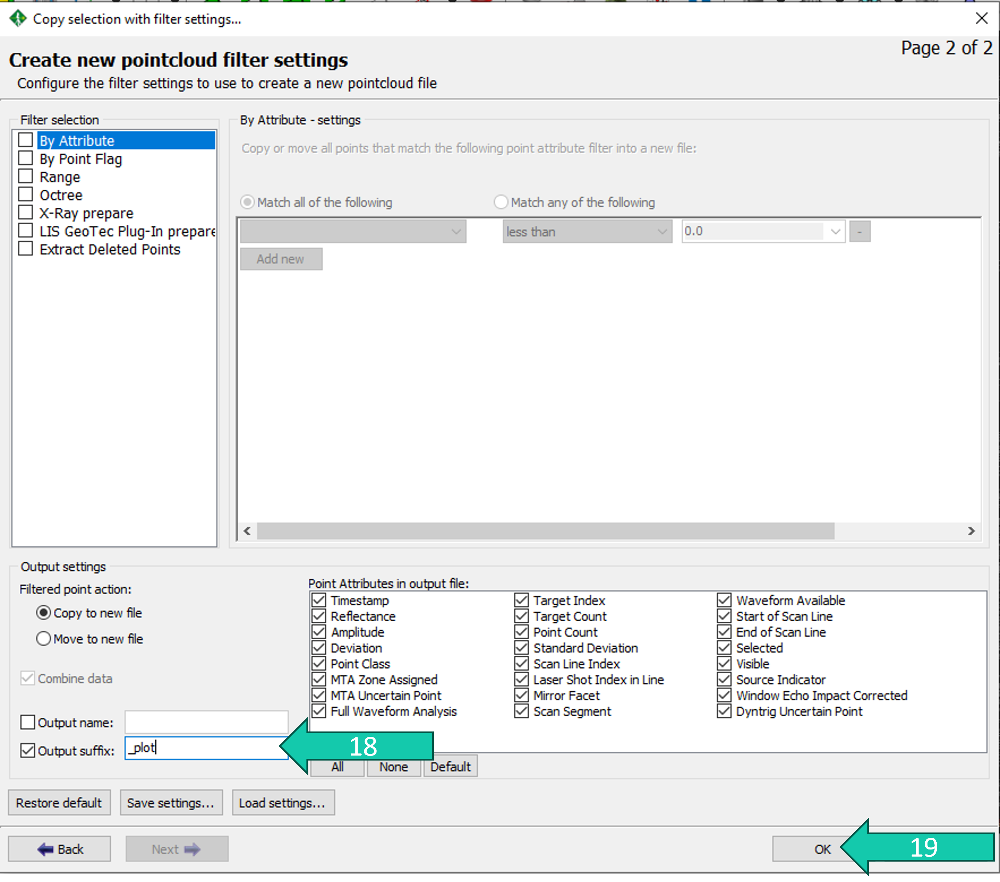

This point cloud will end up under *POINTCLOUDS* in the *Project manager*.

