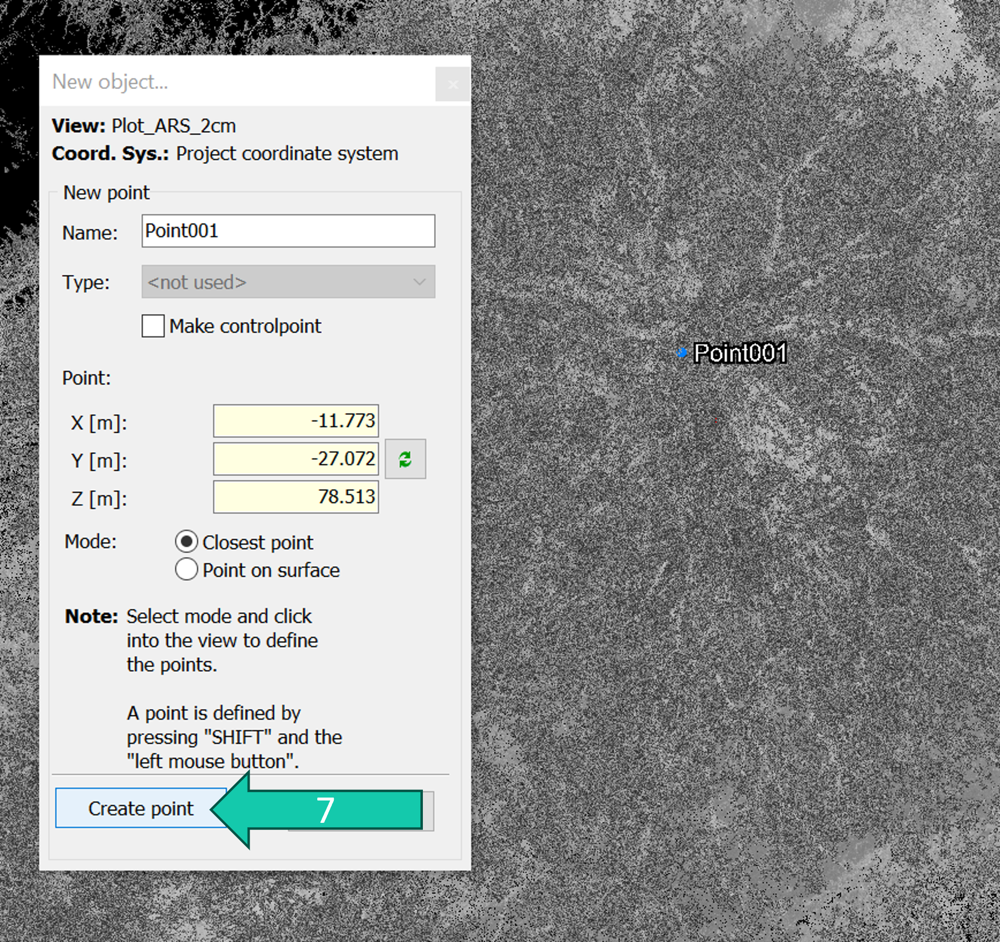
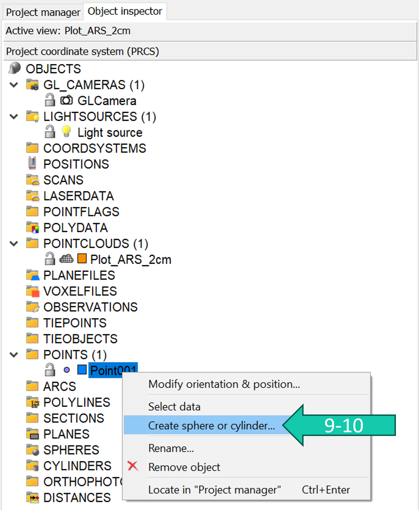
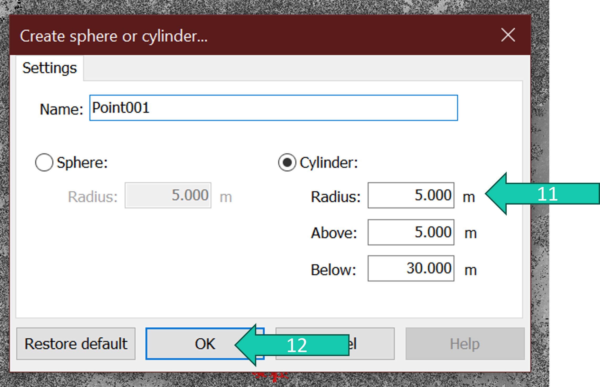
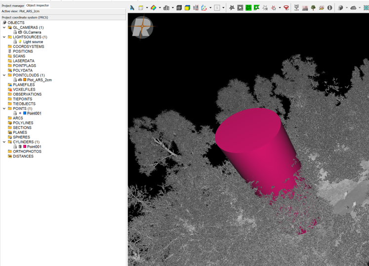
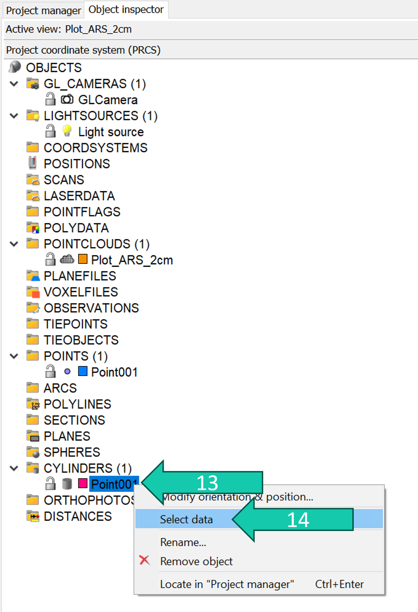
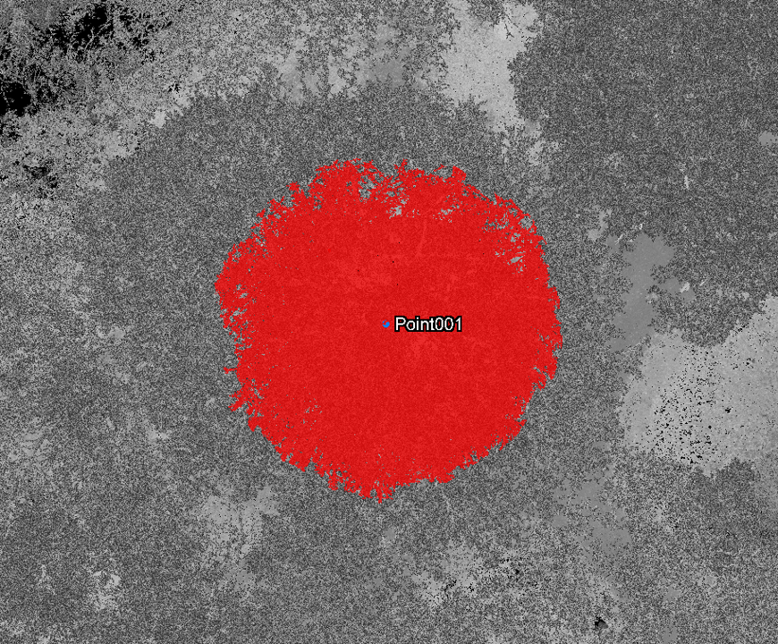

# Select cylinder area

## Steps

Visualise the point cloud from where you want to select a cylindrical area.

1. Click on the point cloud(s) and drag into the viewer (grey area) to visualise the point cloud.
2. Select your preferred view type and click *OK*.

Next we make the cylinder object.

3. Right-click on the point cloud.
4. Go to *New object*.
5. Click on *New point*.

6. Use shift+click to click on a certain point in the point cloud. This will be your center point. 
7. Click *OK*.
8. Click *Close*.

9. Right-click on the point you created in the *Object inspector*.
10. Click on *Create sphere or cylinder...*.

11. Choose the width, and height of the cylinder.
12. Click *OK*.

Your cylinder has been generated and shows ups in the *Object inspector*.

To select the points within the cylinder:

13. Right-click on the cylinder in the *Object inspector*.
14. Click *Select data*.

Now the data is selected.

