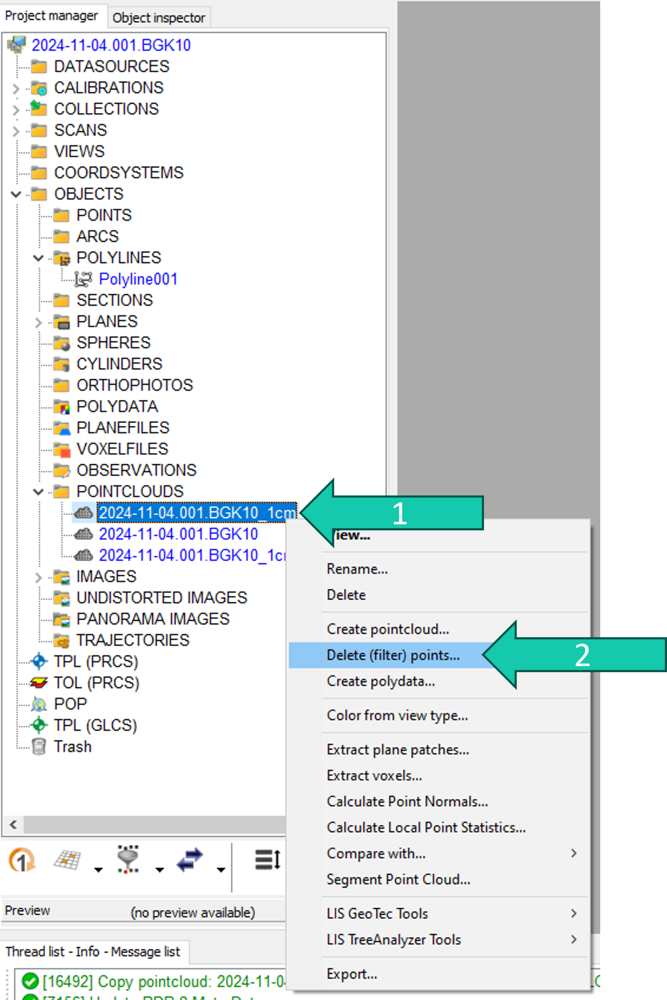
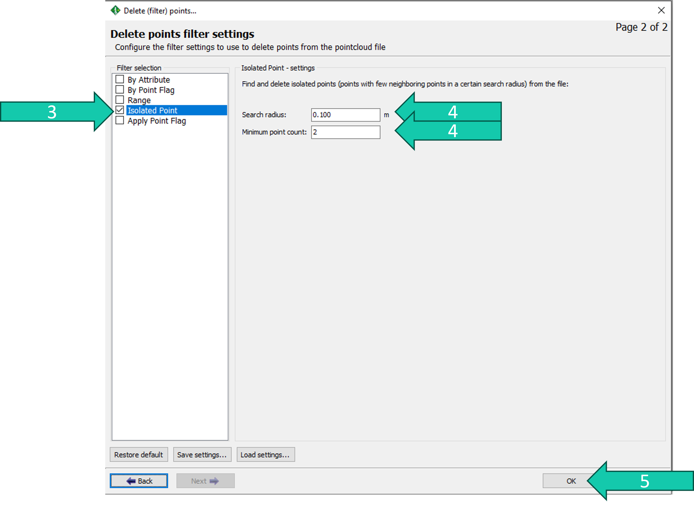

## Delete outlier points 
There is a way to delete outlier (stray) points in RiSCAN PRO.

## Steps

1. Right-click the point cloud from which you want to delete these points.
2. Click on *Delete (filter) points...*.

3. Check the *Isolated Point* box.
4. Choose a *Search radius* and *Minimum point count* setting. You could make copies of your point cloud to test different settings. 
5. Click *OK*.

Now outlier points will be deleted from your point cloud.